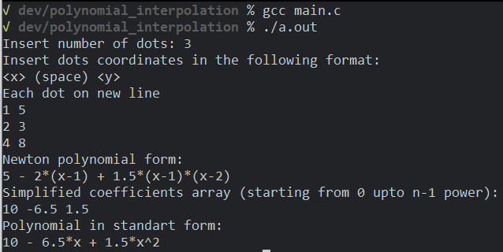
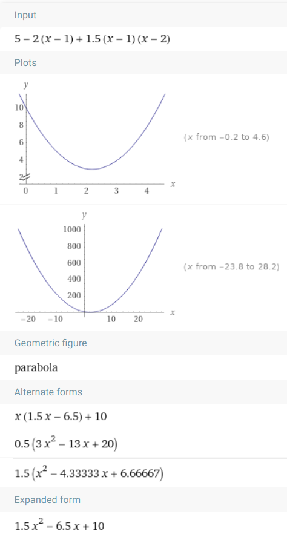
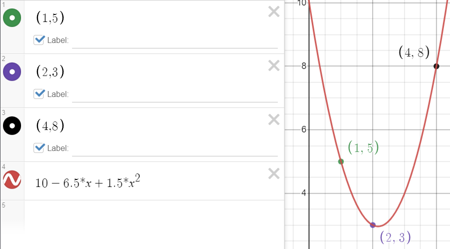
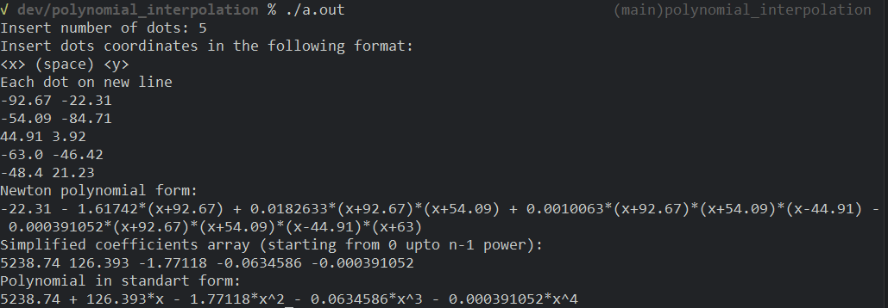
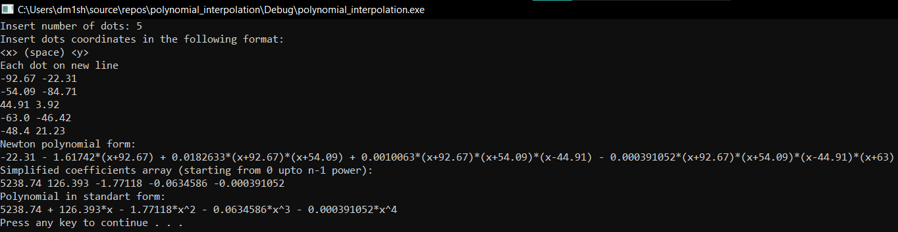
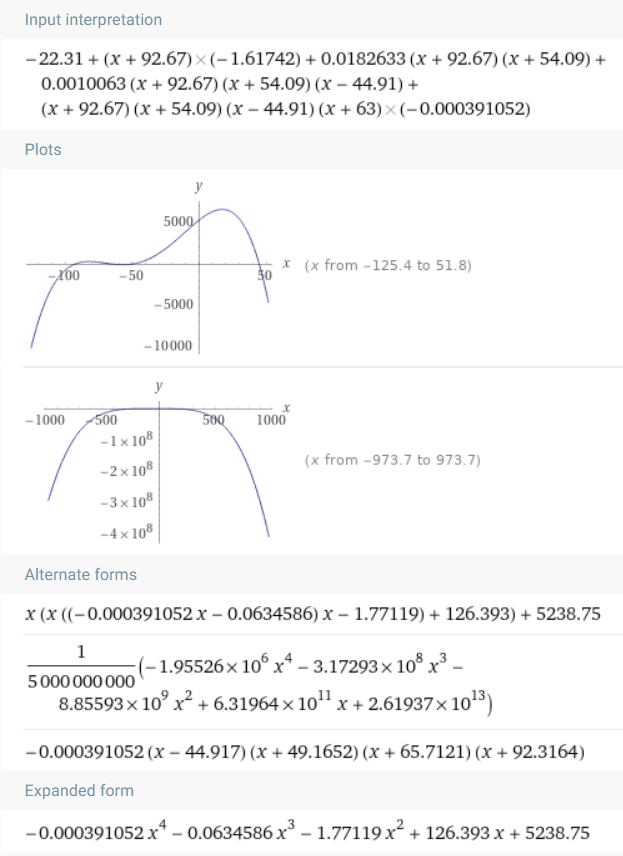
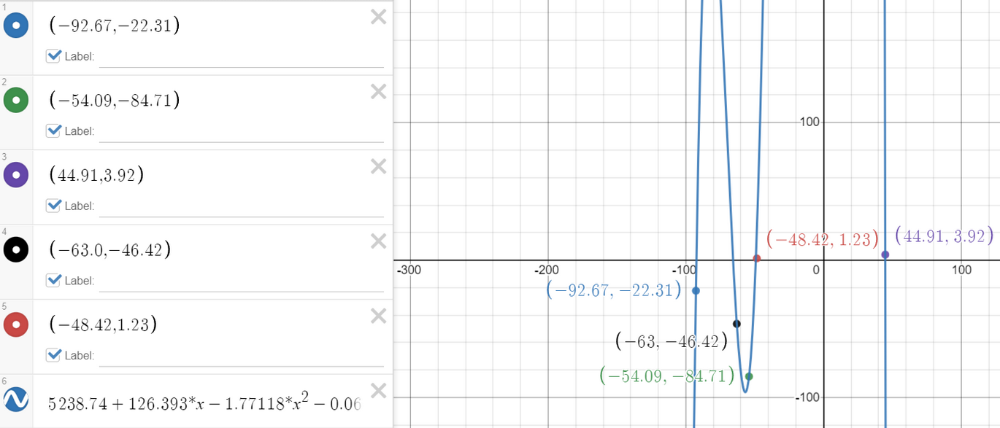

# Polynomial Interpolation

ANSI C program which composes polynomial of n - 1 degree that passes through n dots. It presents it in Newton interpolation polynomial and monic form.

## Interface

Application accepts as standart input decimal below 2147483647 `n` as number of dots, followed by n dots in format: `<x> (space) <y>` on each line, where `x` is an abscisse and `y` is an ordinate of single dot. Dot coordinates must fit [2.22507e-308;1.79769e+308] range by modulo.

Result will be printed to standart output in the following format:

Newton polynomial form:


Simplified coefficients array (starting from 0 upto n-1 power):


Polynomial in monic form:


Where  is a divided difference of ,  are coefficients of resulting monic polynomial

## Data structure

- `n` is an `unsigned int` variable, that is used to input and store number of dots

- `x` is a pointer to array of `n` `double`s, that is used to store abscisses of dots

- `y` is a pointer to array of `n` `double`s, that is used to store ordinates of dots

- `coefficients` is a pointer to array of `n` `double`s, that is used to store coefficients of monic interpolation polynomial

- `i`, `j` are `int` variables, those are used in loops as iterators

- `tmp_polynomial` is a pointer to array of `n` `double`s, that is used to store coefficients of polynomial, resulting during simplification of interpolation polynomial summands.

## Example

Build and run application:

```bash
gcc main.c
./a.out
```

### Input/output

For input n = 3 and the following dots

```plain
1 5
2 3
4 8
```

Output is

```plain
Newton polynomial form:
5 - 2*(x-1) + 1.5*(x-1)*(x-2)
Simplified coefficients array (starting from 0 upto n-1 power):
10 -6.5 1.5
Polynomial in standart form:
10 - 6.5*x + 1.5*x^2
```

### Illustrations

#### Example 1







#### Example 2



or





